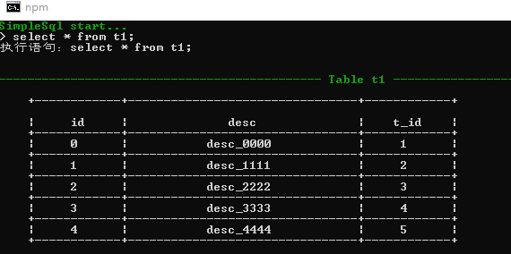
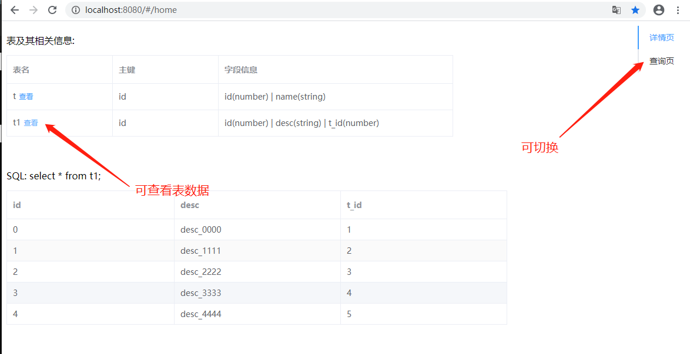
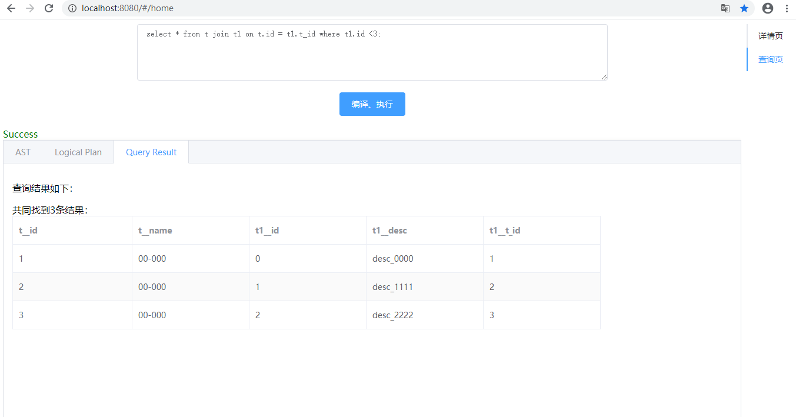
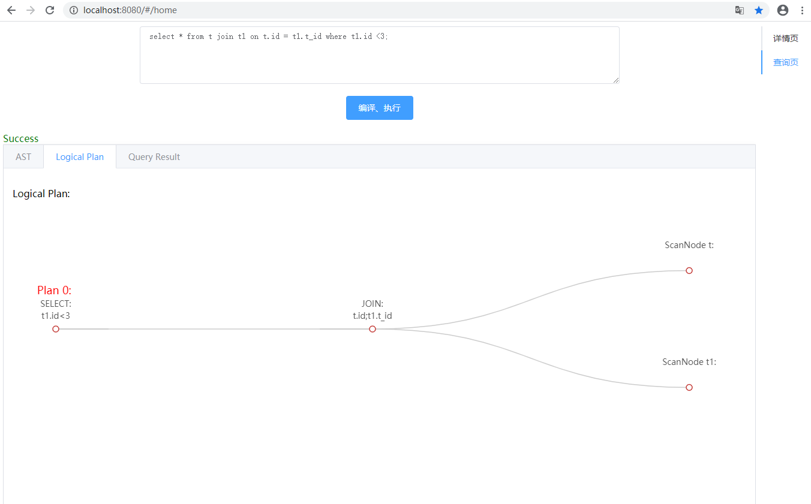
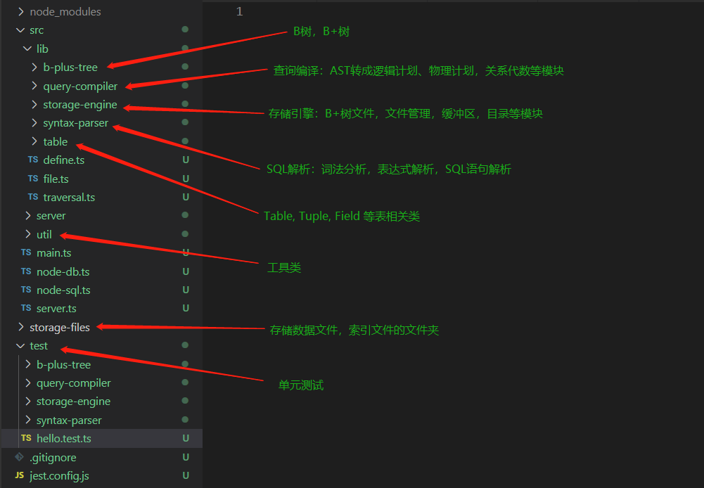

## 关于项目

  用 Typescript + node 简单实现一个玩具级的数据库，仅用于学习。


## 几个问题

  #### 为什么写这个项目 ？
  想深入了解一下数据库。
  #### 绝大多数流行数据库都是用c/c++写的，为什么用 Typescript ？
  js/typescript最熟练，性能方面，对于一个玩具级别的应用应该是够了。
  #### 实现了哪些功能？
  1. 查询管理器：  
    sql解析器，预处理（语义检查），逻辑计划，物理计划，计划执行，关系代数的基本运算；  
    目前支持大部分的DML，DDL还不支持，不过可以在启动前通过配置来实现创建数据表等操作；  
  2. 存储管理器：  
    文件管理，缓冲区；  
  3. 索引:  
    主索引使用b+树文件，辅助索引目前还不支持；
  4. 事务管理器：
    目前还在写。  
  #### 有什么缺陷
  目前还不太稳定性，bug，呃...


## SQL语句类型支持

|   SQL语句类型   | 是否支持  |
|   ----         |  ----    |
|   SELECT语句    |   是    |
|   INSERT语句    |   是    |
|   UPDATE语句    |   是    |
|   DELETE语句    |   是    |
|   WHERE子句     |   是    |
|   JOIN子句      |   是    |
|   笛卡尔积      |   是    |
|   LIKE         |   是    |
|   ORDER        |   是    |

关于DDL，比如创建数据库，选择数据库，创建数据表等语句可以在启动前通过修改schema.json文件来实现。


## 安装依赖

```bash
  npm install
```


## 如何开始
node-db支持两种使用方式
1. 命令行  

```bash
  npm run start
```

启动后可以直接在命令行里输入SQL:  



2. 使用客户端 + 服务器

启动server：
```bash
  npm run server
```
或者开启debug模式：
```bash
  npm run server:debug
```

此外，还需要安装并启动另外一个项目[node-db-client](https://github.com/caiji-programer/node-db-client)
<!-- https://github.com/caiji-programer/node-db-client -->

安装
```bash
  npm install
```
运行

```bash
  npm run serve
```
打开：http://localhost:8080/#/home  

详情页可以查看表信息以及查看表数据  
  

切换至查询页可以输入SQL执行  
  

或者查看物理计划  
  


## 目录说明
<!--  -->



## 关于更详细文档
有人有兴趣再更。


## 参考资料
1. [数据库系统概念](https://book.douban.com/subject/10548379/)
2. [数据库系统实现](https://book.douban.com/subject/4838430/)
3. [MySQL技术内幕：InnoDB存储引擎](https://book.douban.com/subject/24708143/)


## Test

```bash
# unit tests
$ npm run test
```
